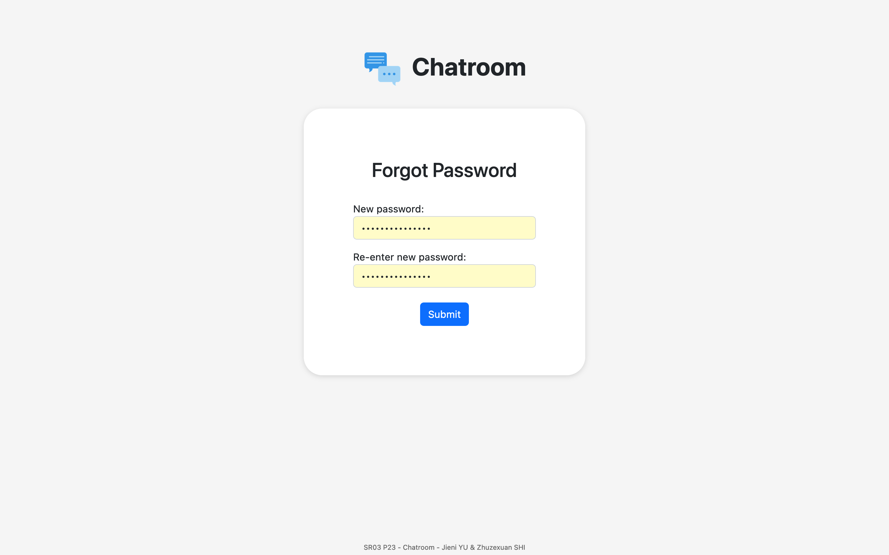
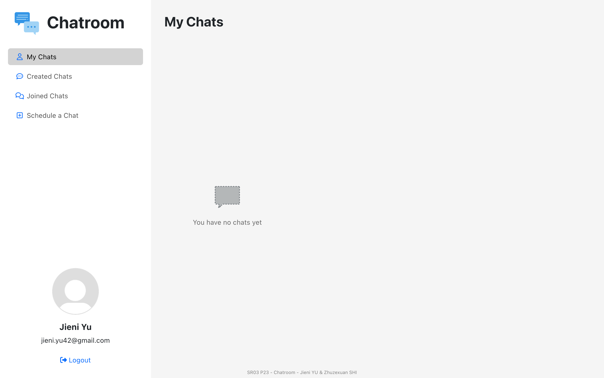

# Chatroom (backend)

> Chatroom application based on React and Spring Boot with a user administration interface.

Backend repository: https://github.com/RA42-y/chatroom-backend

Frontend repository: https://github.com/RA42-y/chatroom-frontend

## Interface

### Login

#### Login page

  

#### Different alerts

  
  
  

### Password management

#### Reset password

Mandatory for the first connection

  

#### Forget password

  
  

E-mail containing link to reset password

  

Password reset page in case you forget your password

  
  

### Administration

#### User list

List of all users (with pagination, 7 per page)

  
  

List of disabled users (with pagination, 7 per page)

  

#### Creation of a new user

  
  

Email containing default password sent to the newly created user

  

#### Operations on existing users

An administrator can modify, delete, deactivate and activate users.

##### Deactivate and activate

  
    

##### Modify

  
  

##### Delete

  

### Chatroom

#### Chat list

List of all chats of the current user (with pagination, 6 per page)

  
  

List of chats created by the current user (with pagination, 6 per page)

  

List of chats to which the current user is invited (with pagination, 6 per page)

  

Empty chat list

  

#### Chat window

functional and expired cat

  
  

#### Creation of a new chat

  
  
  

#### Operations on existing chats

If user is creator: edit, invite users, remove members, delete.

If user is guest: quit

  
  

##### Modify

  
  

##### Invite users

  
  
  

##### Remove members

  
  

##### Delete

  

##### Quit

  

#### Example of a chat

John (client 1) joins the chat "Chat 1", then Jane (client 2) joins.

    

John sends a message

    

Jane receives the message sent by John, then replies.

    

    

John receives the message sent by Jane.

    

Jane leaves the chat.

    

## License

This project is licensed under the MIT License - see the [LICENSE](LICENSE.md) file for details.
